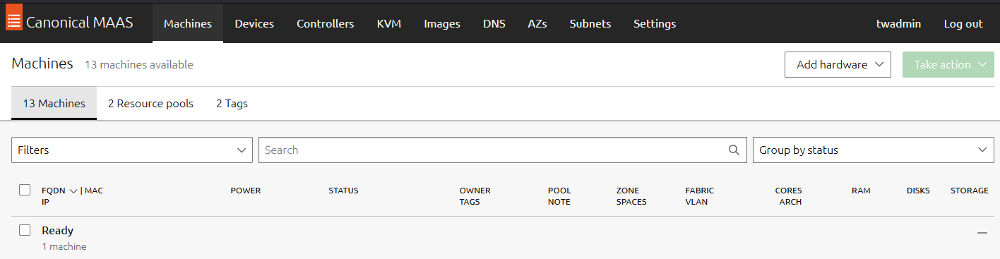

Ubuntu MaaS is software developed by Canonical as a way to provission ubuntu machines without the need to hold an ISO image and perform all of the installation steps. When you have created your server, and its up and running you will already have version of ubuntu that can be deployed to a new machine. 

I have my server already setup check out backlink to install for installation steps. The main dashboard looks like the image below. 

Once this is setup correctly we will want to allow this server for network booting via pfSense gui. Login to your pfSense GUI.

