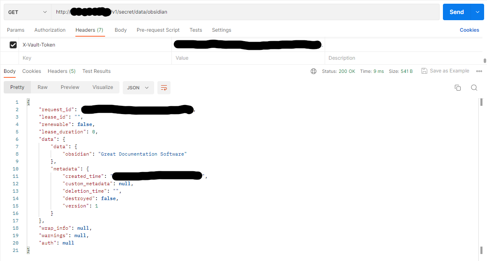
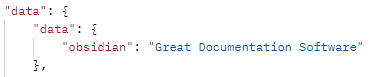

When you have created your first secret and policy, and generated a new token for that policy, you may want to access this key from the vault api, for use in a web app. To do this you will need a few things.

API Url: `http://servername:8200/v1/secret/data` this is the base url
Secret Path: `obsidian`
header: X-Vault-Token = "token created earlier"

In postman I perform the call in the following fashion. the full endpoint `http://servername:8200/v1/secret/data/obsidian`

From here you can see the secret key and value returned from the vault. This could be used in any application with an api call to grab data. because we have a token which is accessing this we can put auditing around its use. If there is a problem revoking and renewing the token will invalidate external unsolicited access.

