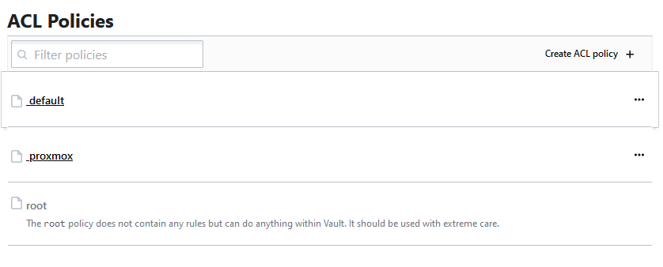
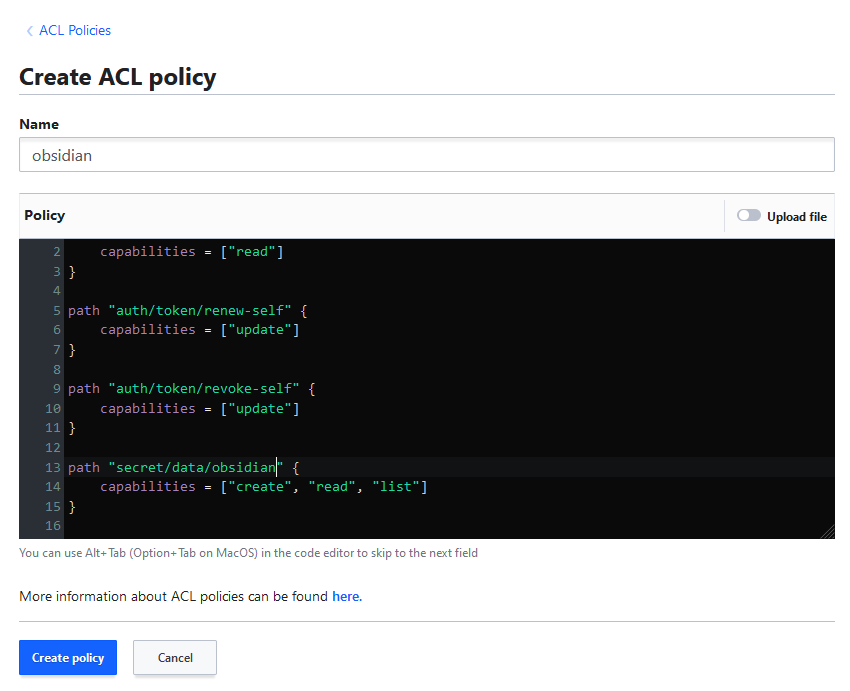
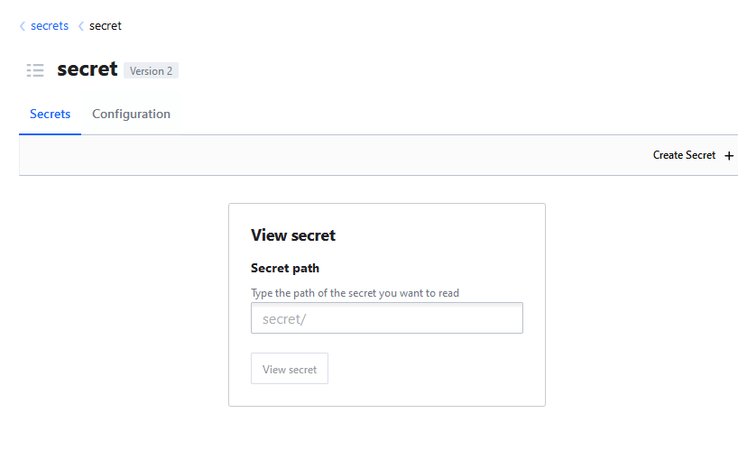
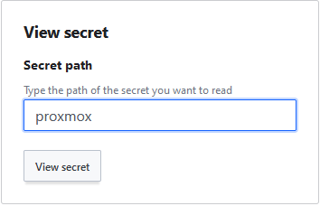
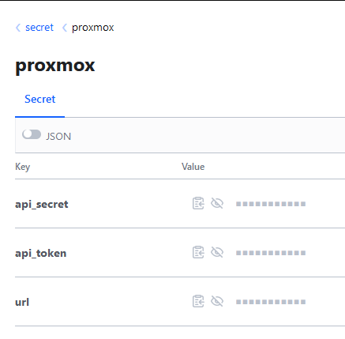
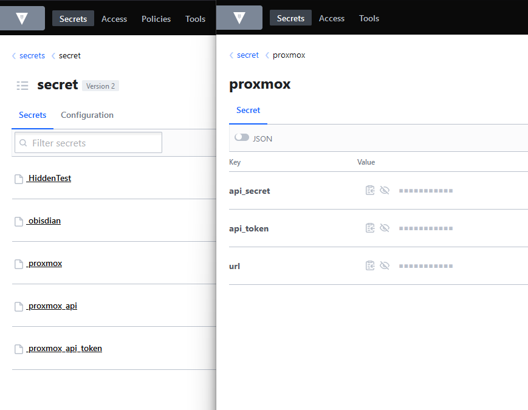

Policies can be used to limit visibility of secrets, and system tools for a given user. There are many capabilities that can be applied an example for my usage is below. Here I have created a new policy by which I will connect via token to the api. 

To add a new policy click on the Policies Link and you are shown all of the ACL Policies visible within the Vault.



From here we will click on the Create ACL Policy + button to add a new policy



To complete the process we click on the create policy button to lock down our secret to root, and anyone who will have the obsidian policy.


The token can:
> read its own token information.
> renew its token
> revoke its token
> create|read|list anything under the secret - Proxmox

Below is the complete polic in HCL format.

```json
path "auth/token/lookup-self" {
    capabilities = ["read"]
}

path "auth/token/renew-self" {
    capabilities = ["update"]
}

path "auth/token/revoke-self" {
    capabilities = ["update"]
}

path "secret/data/obsidian" {
    capabilities = ["create", "read", "list"]
}
```

Because this token does not have the appropriate information to list all the secrets. When login as this user via the ui, and visiting the secrets page. I see no secrets visible



If you type in proxmox into the secret path we can see the secrets we are after and only those. 


Clicking on the view secret will load the secret, only if we have visibility to it.



Having two users logged in we can see the difference. 

Below you can see that the root user can see a lot more then the proxmox user can see. Having this separation works well as you know the proxmox user is not able to edit,update any other secrets in the vault.


