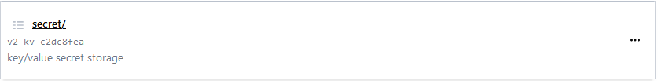

Login in to the vault ui via the servername:8200/ui with the correct root token, this will allow you to perform all of the steps necessary to add a  new secret. Click on the secrets link and you will be shown the cubbyhole, and secret sections. Cubbyhole is only visible to the logged in user context and not external from the users context.

Click on the secret link to open the secret section of the vault

you will be greeted with the following page which you can see previously created secrets, as well as a button to add/create a new secret.

