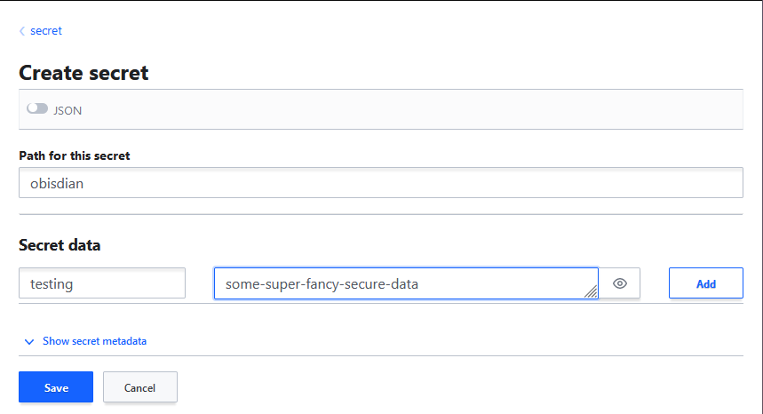

Login in to the vault ui via the servername:8200/ui with the correct root token, this will allow you to perform all of the steps necessary to add a  new secret. Click on the secrets link and you will be shown the cubbyhole, and secret sections. Cubbyhole is only visible to the logged in user context and not external from the users context.

Click on the secret link to open the secret section of the vault


you will be greeted with the following page which you can see previously created secrets, as well as a button to add/create a new secret.


From here select the Create Secret + button to create a new secret


From the create screen you can enter the path, this is the name stored on the secret, and if using the api will be the `/secret/data/:path` section `/secret/data/obsidian`



From here you can click on the save button. If you prefer to enter the data into the system as a json obect then you can click the json toggle and enter in the following details to get the same results.

```json
{
  "testing": "some-super-fancy-secure-data"
}
```


From here we have all the items we need and can click on the save button. This will store the secret for us and we can then perform a get on the api end point.

