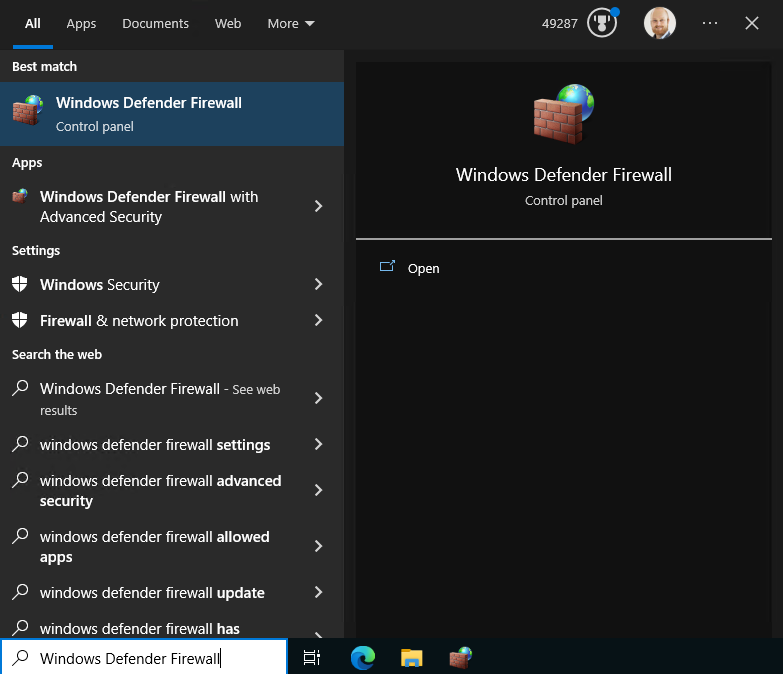
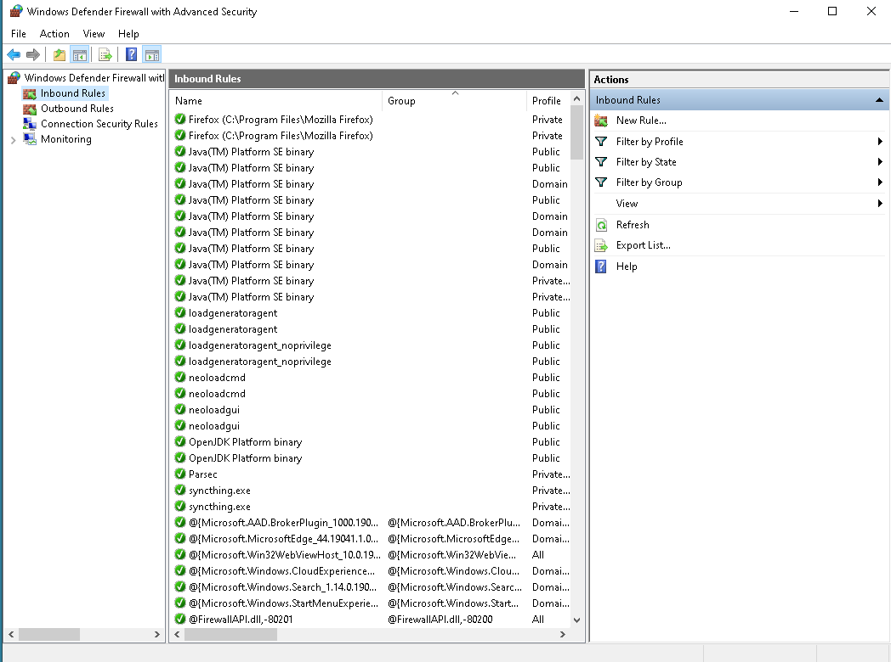
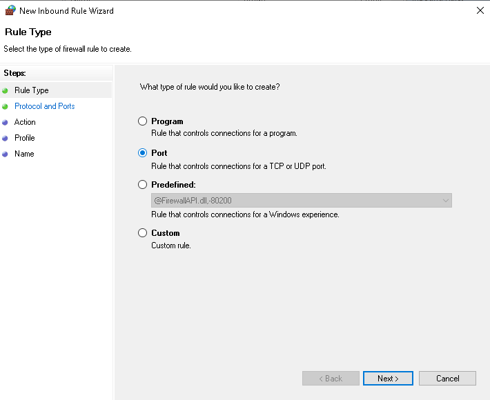
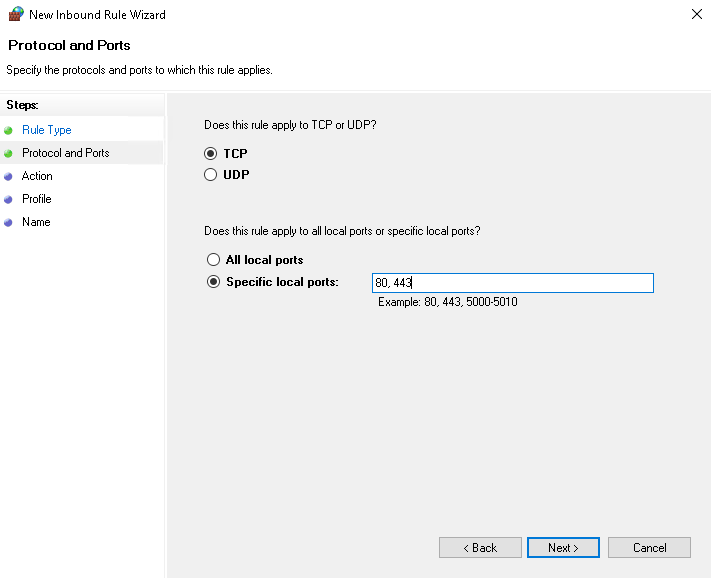
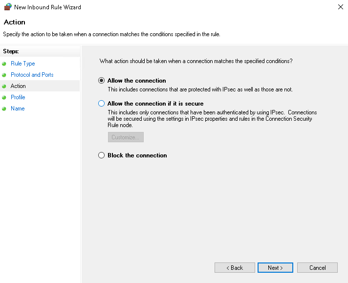
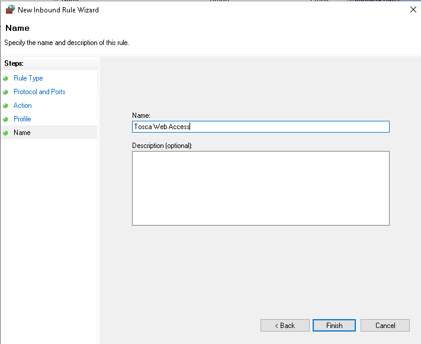

#### Firewall Ports To Open

## Tosca Administration Console

| Port Number | Direction |
|---|---|
| 80 | Outbound |
| 80 | Inbound |
| 443 | Outbound |
| 443 | Inbound|
| 5005 | Inbound |
| 5002 | Inbound |
| 5003 | Inbound |
| 5000 | Inbound |

#### Open Ports With Windows

Search For the Windws Defender Firewall and select it from the menu

Next you will want to follow these steps for all ports. Start by clicking on the Inbound Rules item. Click on the New Rule item from the Actions tab on the right of the window

Select the rule type of Port as we will want to open TCP Ports to this machine for the network

In Bound HTTP/HTTPS - Here we will want the specific ports to match, I created two inbound rules, 

> Firstly for Web Access (80, 443) - inbound
> Secondly for Services Access(5000, 5002, 5003, 5005) - inbound

Allow the connection if not already selected. This permits the ports to be opened on the machine

Select the rule apply on, I have selected all as I am running from a local personal network

Give the rule a name. 

80,443 - inbound - Tosca Web Access
80,443 - outbound - Tosca External We Access
5000,5002,5003,5005 - inbound - Tosca Services

