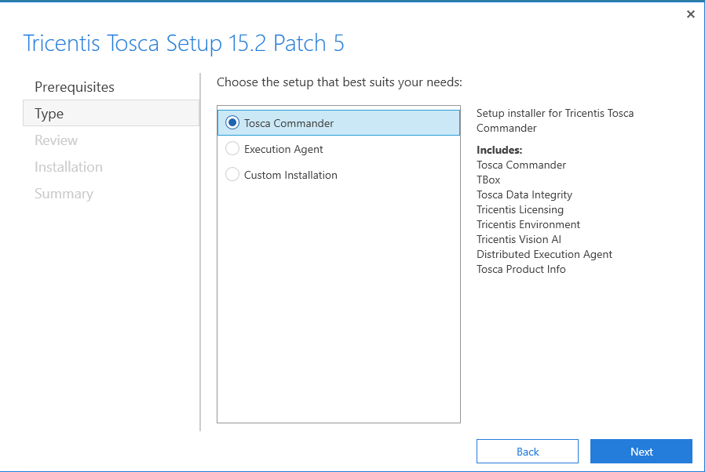

#### Tosca Software Used for this walkthrough
#### Tosca Commander 15.2 Patch 5

Double click on the Tricentis Tosca 15.2 Patch5.exe to start the Tosca Commander Installation

The following splash screen will dsiaply, ensure you click on the I agree check box before click

