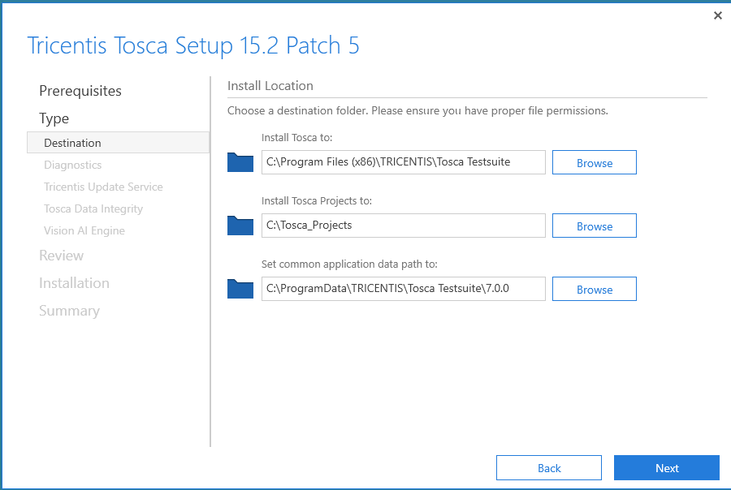
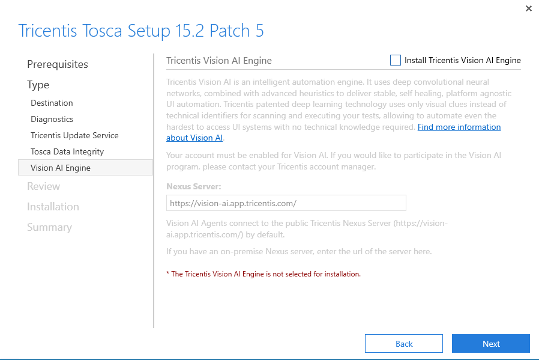

#### Tosca Software Used for this walkthrough
#### Tosca Commander 15.2 Patch 5

Double click on the Tricentis Tosca 15.2 Patch5.exe to start the Tosca Commander Installation

The following splash screen will dsiaply, ensure you click on the I agree check box before clicking on the continue button.

Next you will be shown the installed and required Prerequisites. These will auto download when not currently present on the machine.

Next is the Tosca Installation location, this is where Tosca will install all of its components too.

Next will be the Tricentis Update Service, this will help update parts of Tosca without the Tosca installer.

Next is the Tricentis Vision AI engine, for this demonstration this will be disabled.

Lastly you will see the Summary page. Here we will click on the install button and let Tosca Commander be installed to the local machine.

