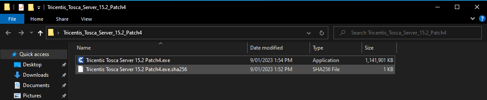
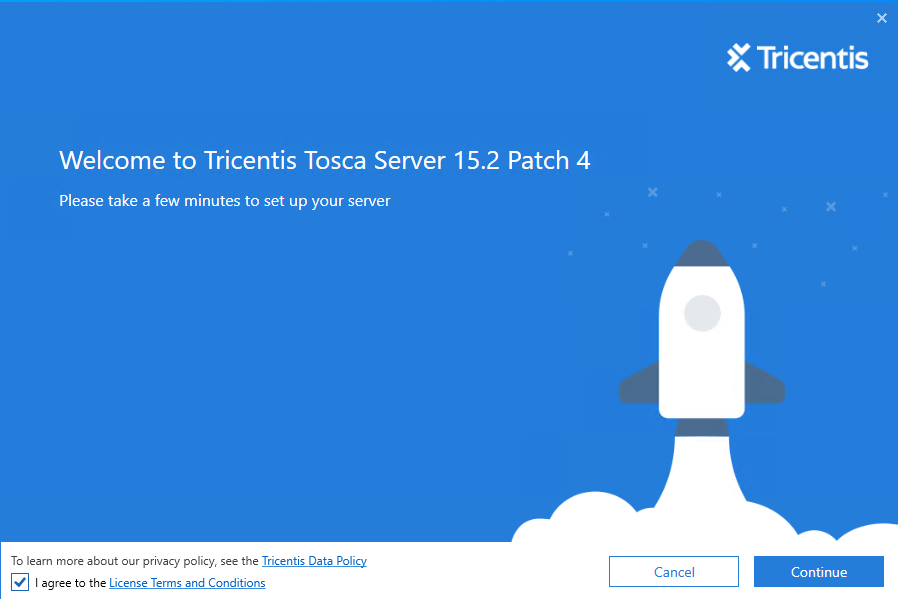
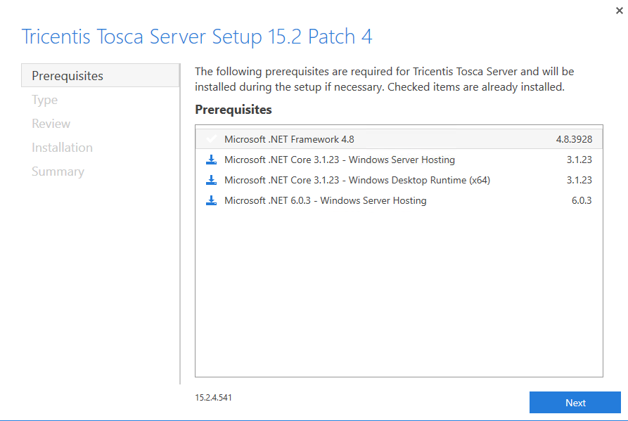
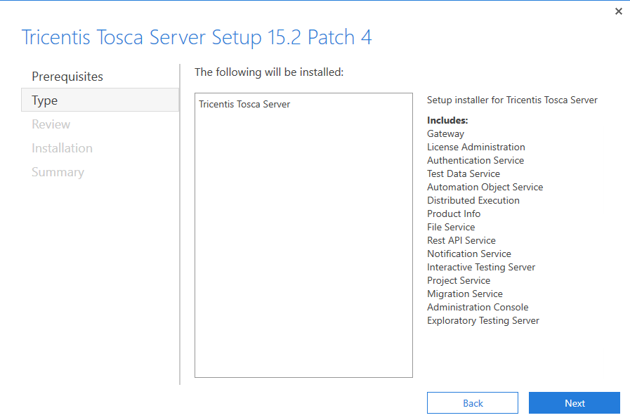
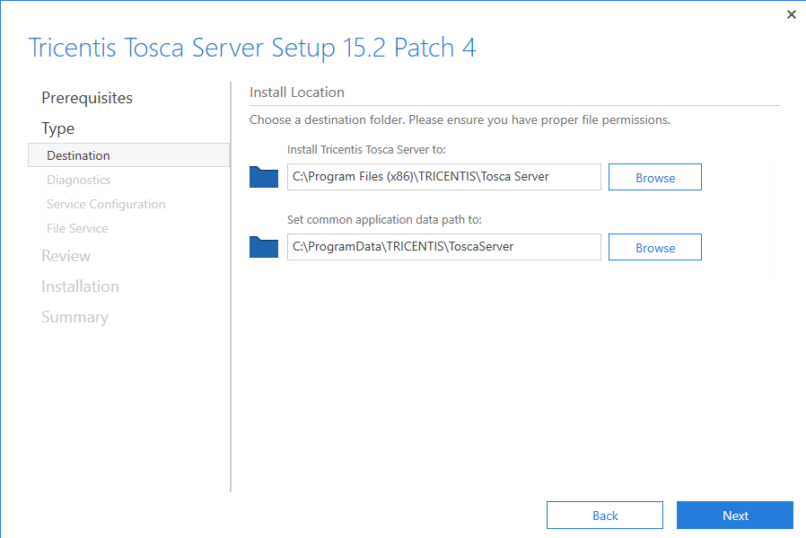
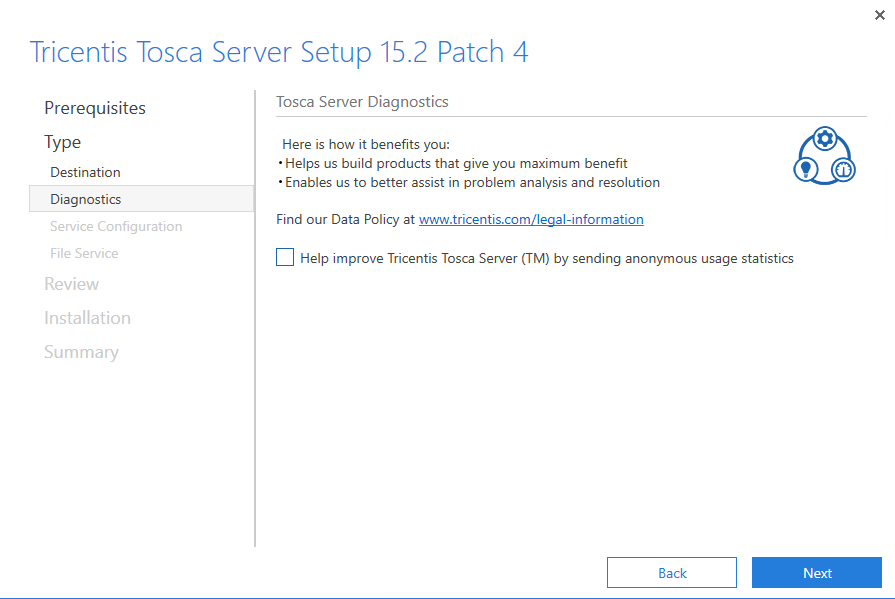
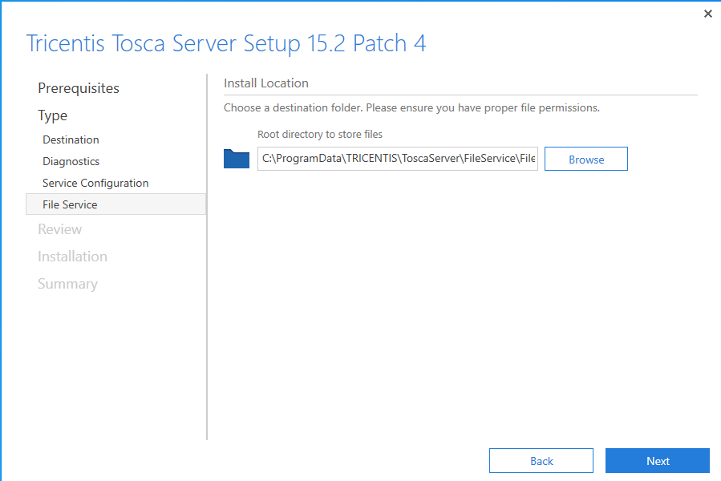
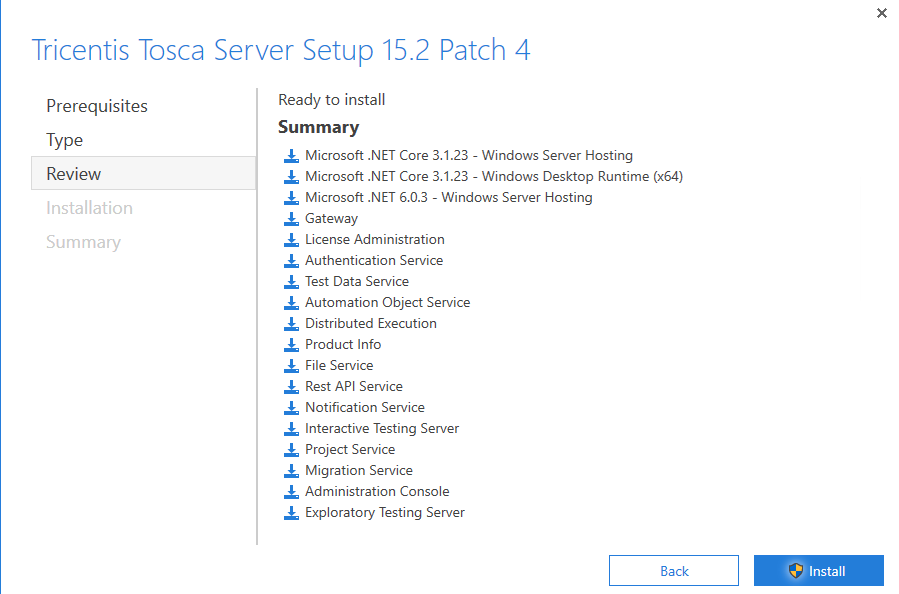

--- 
### HTTPS Certificate Installation (Windows)

Have your certificate issued by your certificate issuer, copt the crt file. The best way to get the certificate installed is to double click on the .crt on your computer and install. You will also require the .p12 key for Tosca To be happy. You will also need to perform the below install steps via the .p12 certificate also.

Here I have saved the crt file for tosca.turtleware.au to my machine as ToscaServer.crt.

Double clicking the .crt file will show the following window.

Click on the Install Certificate to start the install wizard

Click on Local Machine and then the next button.

Select the Automatically select the certificate store based on the type of certificate radio button

Click the finish button to install the certificate

Seeing the above window says the certificate has been setup and install correctly. 

Now we are ready to start the Tosca Server install for HTTPS connections

--- 
### Install Tosca Server (HTTPS)

Launch Tricentis Tosca Server 15.2 Patch <#>.exe

The .exe will load into this splash screen ensure you click on the I agree check box before trying to continue.

Next you will see a list of pre-requisites needed for the machine to work with Tosca Server. To accept these and continue click the next button

After the pre-requisites you will see a list of items that will be installed. Here we see Tosca Server, as that is the only item being installed by this instller. Click the next button to proceed

After the type of installation we will be provided the Tosca Server Destination details, this is where you would like to store the Tosca Server install. Click next to proceed once happy with the destination

Here we will uncheck the Anonymous usage stats. Click Next

Click Next on the Tosca Server Diagnotics page to remove the anonymous usage statistics. 

Below we will need to find our Certificate Thumbprint, which can be found by

Double Clicking on our Certificate.crt file as installed in the step above

We will need to select and copy the thumbprint, and then paste this into the Tosca Installer. 

You know everything will be fine when you get a green tick. If you started the installer then installed your certificate, cancel out of the installer and reload it. this will validate the certificate when you provide the Thumprint again.

Next we will set the File Server location. Select the location you would like to store this and click next.

Next is the review page. Here is a list of all the installation items which will be added to the machine. Clicking on the Install button will start the installation process.

---
[Next Steps : 04 - Database Repository Setup](04%20-%20Database%20Repository%20Setup.md)
