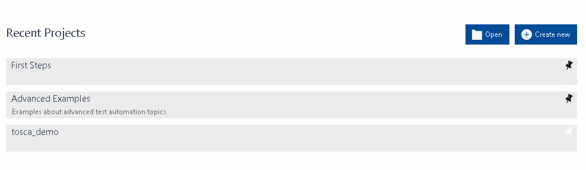
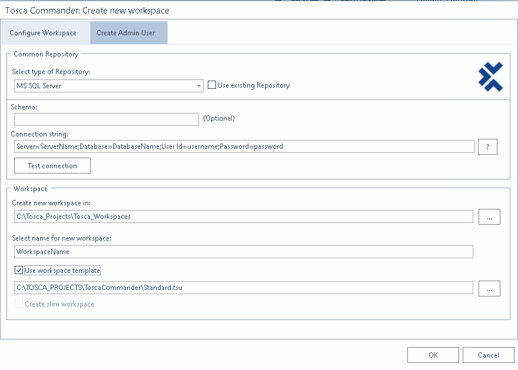

#### Multi User Repository Setup

The best way to run Tosca is to use a multi user repository to do so either of the following links will help you get setup.

Preparing an MSSQL server for use with Tosca Commander:
https://documentation.tricentis.com/tosca/1510/en/content/installation_tosca/prepare_mssql.htm

Preparing an Oracle Server for use with Tosca Commander:
https://documentation.tricentis.com/tosca/1510/en/content/installation_tosca/prepare_oracle.htm

Once you have everything setup accordingly you will then need to download and create a new workspace

#### Creating a new Repository For Tosca.

Load Tosca Commander

Click on the Create New button to create a new workspace

Fill in the appropriate information

| Input | Value |
|---|---|
| Select Repository Type | MS SQL Server |
| Use Existing Repositry | Uncheck (create new workspace, and new repository in msssql)|
| Connection string | Server=ServerName;Database=DatabaseName;User Id=UserName;Password=password; (No Quotes are needed here)|
| Select Namespace | Name Tosca |

