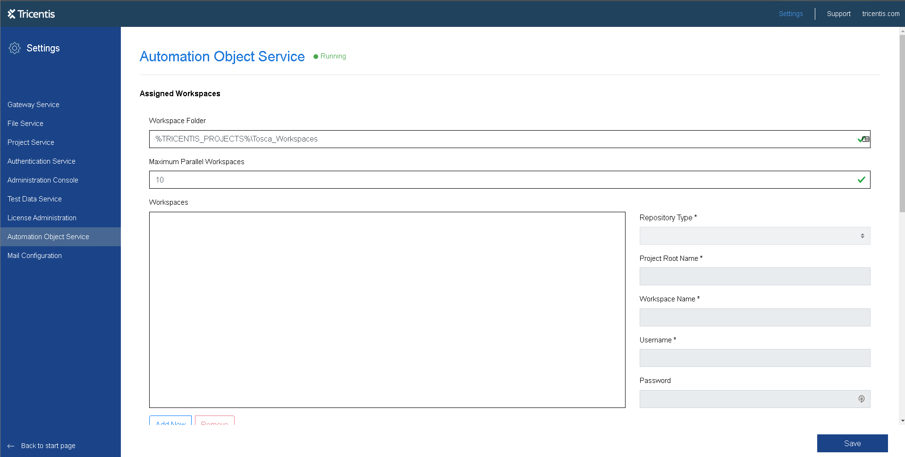
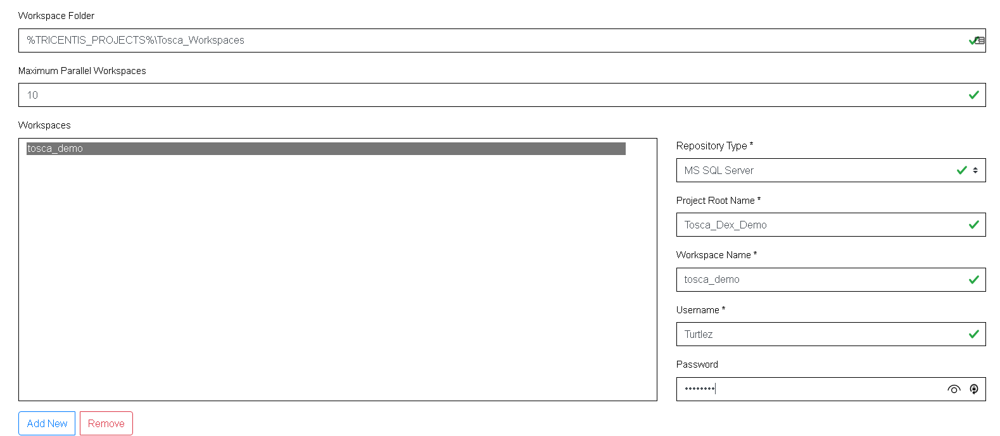
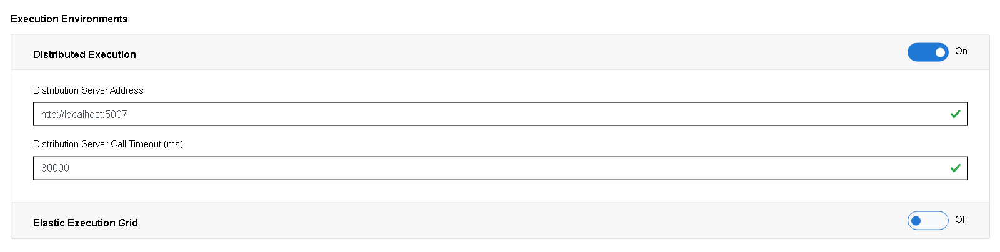
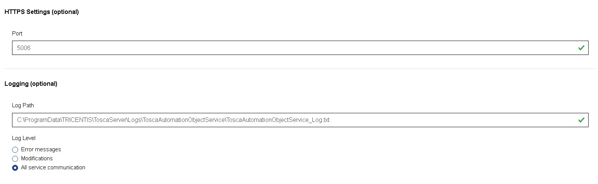
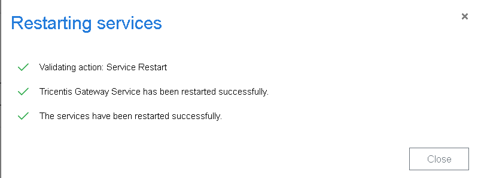

#### Enabling Dex Server

Navigate to ```here```


You will want to edit the Tricentis.Distribution.ServerService.exe.config with notepad

When loaded find the element you are after.

`ctrl + f ` and then enter `tricentis.distributionserver.properties.settings`


make sure the EnableWorkspacelessExecution is true

#### Setup AOS

Navigate to the following url : http://localhost/#/configuration/ao

Here is the landing page for the Automation Object Service.


Add your workspace details which you saved in step 04 Database Repository Setup. Make sure all inputs have a tick so you ensure you have correctly setup the service.



Next make sure the http settings for the Distributed Execution are set accordingly.



Make any changes as per the following settings.



Lastly click on the save button. when completed you will see this image when all successfully applied and restarted.

