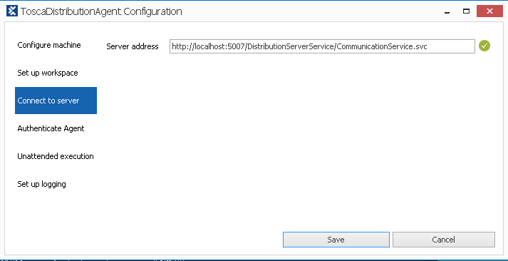
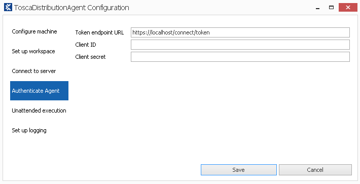
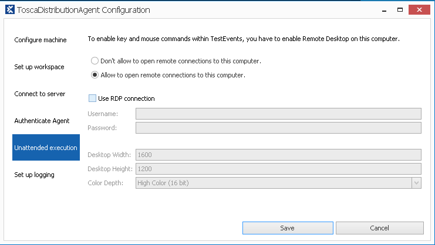
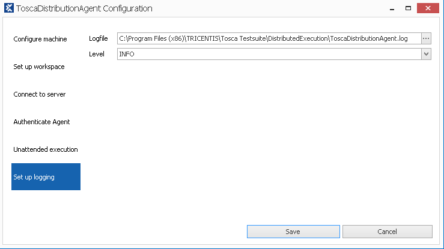
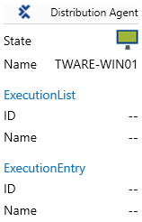

#### Configuration Settings

Locate the ToscaDistributionAgent

Navigate to ```C:\Program Files (x86)\TRICENTIS\Tosca Testsuite\DistributedExecution```


Right click the ToscaDistributionAgent.exe and select run as administrator. The Agent will then start and become active


Right click on the agent and select configure agent


Enter the Machine details, these will determine how Tosca will filter agents for test events. As you can select agents for a test event based on the information stored in this screen. These are not mandatory or require changing, however will only match when these values are selected in tosca. will be covered later in the test event setup.


Setup the workspace details. Click the ... button and navigate the the `*.tws` file which Tosca created for the repository back in the 04 - Database Repository Setup


Next Check that the Connect To Server is returning a green tick this means everything is sorted for the communication service.



Next if there is a need to setup tokens and client secrets they can be done under the authenticate agent section



Next Unattended execution is where you put in remote desktop information. this will include the user name and password, and the desktop settings to use for the remote connection.



Setup logging is the last section and this will allow you to see the log location, as well as changing the logging message type.



Clicking on the save button will save the configuration to the machine and allow the agent to be set to active status.

left click on the agent icon in the taskbar try, this will show the agent details


---
[Next Steps : 07 - Create Test Events](07%20-%20Create%20Test%20Events.md)