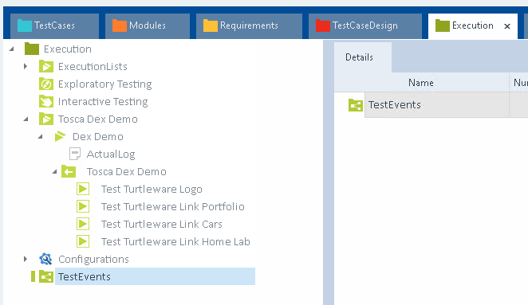

#### Tosca Commander Settings

Add to the tosca configuration settings. Project -> Settings

Navigate to the Settings -> Commander -> DistributedExecution -> Monitor URL add in your Monitor url for tosca server with port 5007 and urui /Monitor

http://localhost:5007/Monitor

Navigate to the Settigns -> Commander -> DistributedExecution -> Server

ensure this is correct load the url in a browser 

Ensure you also set the Settings -> Tricentis Services correctly http://server:5002

#### Creating Test Events In Tosca Commander

To start with we want to check the Test Events Section of the Execution lists tab.

Next we will want to add our test cases to the test event. to do so we need to checkout our 
`Test Events\Tosca Dex Demo`

Drag and Drop our execution list onto the test event.

When copied we will see the below

Next we will want to make sure we have the required settings fixed, and we are able to run via an agent. To do so we want to check through the execution list configuration tab.

