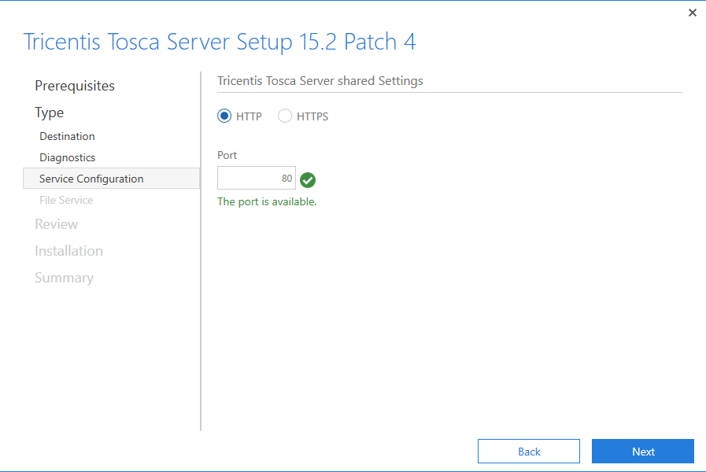
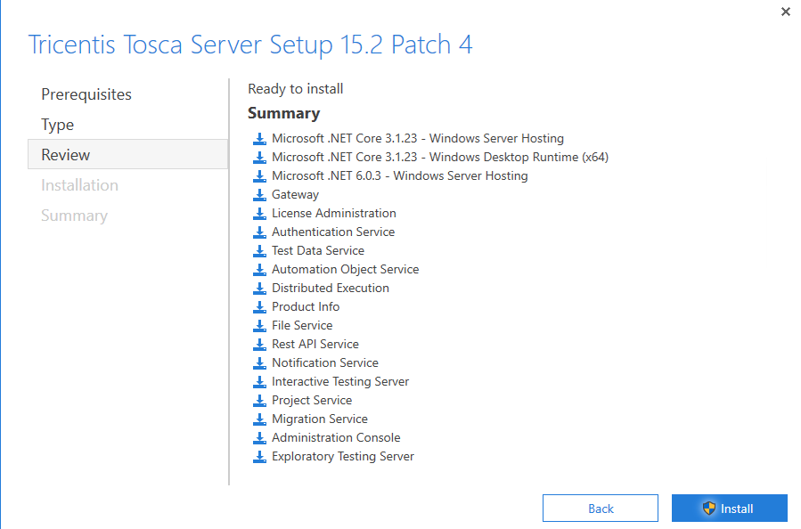

Tosca Server 15.2 Patch 4

### Tosca Server Installation
Install Tosca Server 15.2 Patch 4 First 

Launch Tricentis Tosca Server 15.2 Patch <#>.exe

The .exe will load into this splash screen ensure you click on the I agree check box before trying to continue.

Next you will see a list of pre-requisites needed for the machine to work with Tosca Server. To accept these and continue click the next button

After the pre-requisites you will see a list of items that will be installed. Here we see Tosca Server, as that is the only item being installed by this instller. Click the next button to proceed

After the type of installation we will be provided the Tosca Server Destination details, this is where you would like to store the Tosca Server install. Click next to proceed once happy with the destination

Here we will uncheck the Anonymous usage stats. Click Next

For the purposes of this install I will be using HTTP as I don't have a valid Certificate Thumprint for the HTTPS instance. Click Next.

Next we will set the File Server location. Select the location you would like to store this and click next.

Next is the review page. Here is a list of all the installation items which will be added to the machine. Clicking on the Install button will start the installation process.

